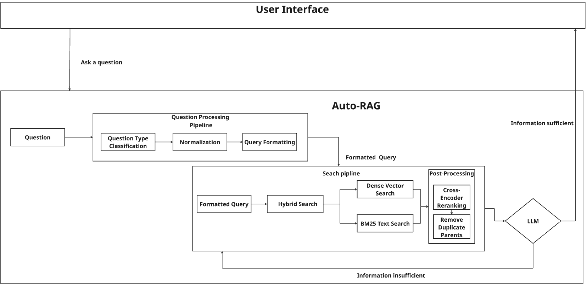

# Vietnamese Traffic Law Q&A System 🚦

A sophisticated Retrieval-Augmented Generation (RAG) system designed to answer questions about Vietnamese traffic laws. The system combines vector search with Large Language Models to provide accurate and comprehensive legal information.

## Features

- **Intelligent Question Processing**: Automatically classifies questions into violation-related or general information queries
- **Multi-LLM Support**: Compatible with both OpenAI and VLLM backends
- **Vietnamese Language Processing**: Specialized handling of Vietnamese text with synonym replacement
- **Iterative RAG**: Multi-step retrieval process to gather comprehensive information
- **Interactive Web Interface**: User-friendly Streamlit interface with detailed response tracking
- **Vector Search**: Hybrid search using Weaviate vector database

## Architecture



## Installation

### Prerequisites

- Python 3.8+
- Access to Weaviate Cloud or local Weaviate instance
- OpenAI API key (for OpenAI backend) or VLLM server (for VLLM backend)

### Setup

1. **Clone the repository**
   ```bash
   git clone <repository-url>
   cd VN_LAW_QA_SYSTEM
   ```

2. **Install dependencies**
   ```bash
   pip install -r requirements.txt
   ```

3. **Set up environment variables**
   Create a `.env` file in the root directory:
   ```env
   # Weaviate Configuration
   WEAVIATE_URL=your_weaviate_cluster_url
   WEAVIATE_API_KEY=your_weaviate_api_key
   
   # OpenAI Configuration (if using OpenAI backend)
   OPENAI_API_KEY=your_openai_api_key
   ```

## Usage

### Running the Application

Start the Streamlit web interface:

```bash
streamlit run rag/UI.py
```

The application will be available at `http://localhost:8501`

### Using the Interface

1. **Configure System**: Use the sidebar to select your LLM provider and configure parameters
2. **Initialize System**: Click "Khởi Tạo Hệ Thống" to initialize the RAG system
3. **Ask Questions**: Enter your Vietnamese traffic law questions in the text area
4. **View Results**: Get detailed answers with processing statistics and source information

### Example Questions

- "Uống rượu bia rồi lái xe ô tô bị phạt như thế nào?"
- "Quy định về tốc độ tối đa trong khu dân cư là gì?"
- "Xe máy đi vào làn ô tô sẽ bị xử phạt ra sao?"

## Configuration

### System Parameters

| Parameter | Description | Default |
|-----------|-------------|---------|
| `top_k` | Number of documents to retrieve | 10 |
| `alpha` | Hybrid search balance (0=BM25, 1=vector) | 0.5 |
| `max_iterations` | Maximum RAG iterations | 3 |
| `temperature` | LLM generation temperature | 0.2 |

### LLM Backends

#### OpenAI Backend
- **Model**: gpt-4o-mini
- **Configuration**: Set `OPENAI_API_KEY` environment variable

#### VLLM Backend
- **Default Model**: Qwen/Qwen2.5-14B-Instruct-AWQ
- **Configuration**: Set API URL in the interface (default: http://your-ipv4:8000/v1/completions)

## Project Structure

```
VN_LAW_QA_SYSTEM/
├── rag/
│   ├── UI.py                 # Streamlit web interface
│   ├── auto_rag.py          # Core RAG engine
│   ├── q_process.py         # Question processing and classification
│   ├── VLLM.py              # VLLM client implementation
│   ├── prompt.py            # Prompt templates
│   └── traffic_synonyms.py  # Vietnamese traffic term synonyms
├── assets/                  # Images and documentation assets
├── requirements.txt         # Python dependencies
└── README.md               # This file
```

## Dependencies

### Core Dependencies
- **llama-index**: RAG framework and vector operations
- **transformers**: Transformer models and embeddings
- **sentence-transformers**: Sentence embedding models
- **weaviate-client**: Weaviate vector database client
- **streamlit**: Web interface framework

### Vietnamese Language Processing
- **underthesea**: Vietnamese NLP toolkit
- **pyvi**: Vietnamese word segmentation

### LLM Integration
- **openai**: OpenAI API client
- **tiktoken**: Token counting for OpenAI models

### Utilities
- **python-dotenv**: Environment variable management
- **loguru**: Logging framework
- **tqdm**: Progress bars

## How It Works

1. **Question Processing**: 
   - Normalizes Vietnamese text
   - Replaces colloquial terms with legal terminology
   - Classifies question type (violation vs. general information)

2. **Query Formatting**:
   - Formats questions into standardized queries
   - Different templates for violation and general information questions

3. **Iterative Retrieval**:
   - Retrieves relevant documents from Weaviate
   - Evaluates information sufficiency
   - Generates follow-up queries if needed
   - Continues until sufficient information is gathered

4. **Answer Generation**:
   - Synthesizes information from all retrieval iterations
   - Generates comprehensive, structured answers
   - Includes specific penalty amounts, legal procedures, and conditions

## Features in Detail

### Question Types

- **Violation Questions**: Handle penalty and punishment inquiries
- **General Information**: Answer questions about traffic law regulations

### Multi-Iteration RAG

The system can perform multiple retrieval rounds to gather comprehensive information, especially useful for complex questions involving multiple violations.

### Vietnamese Language Support

- Specialized Vietnamese embedding model: `bkai-foundation-models/vietnamese-bi-encoder`
- Traffic terminology normalization
- Context-aware synonym replacement

### Response Tracking

- Token usage monitoring
- Processing time measurement
- Query history and iteration tracking
- Source document display

## Contributing

1. Fork the repository
2. Create a feature branch
3. Make your changes
4. Test thoroughly with Vietnamese traffic law questions
5. Submit a pull request

## License

This project is licensed under the MIT License - see the LICENSE file for details.

## Support

For questions or issues:
1. Check the existing issues in the repository
2. Create a new issue with detailed description
3. Include sample questions and error messages if applicable

---

**Note**: This system is designed for educational and informational purposes. Always consult official legal documents and qualified legal professionals for authoritative legal advice.