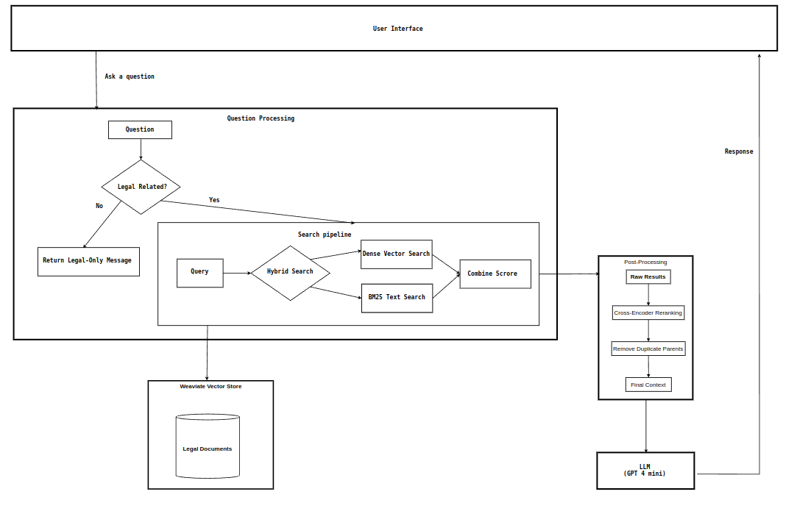
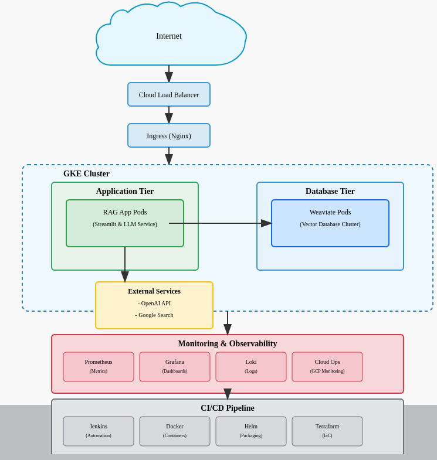

# Vietnamese Legal 
This project aims to develop a Vietnamese legal question-answering system using the Retriever-Reader architecture. The system is designed to retrieve relevant legal documents and provide answers to user queries based on the retrieved documents.


## Setup

### Prerequisites
- Python 3.10
- Docker
- Virtual Environment

### Installation
1. Clone the repository:
    ```sh
    git clone https://github.com/Drissdo185/VN_LAW_QA_SYSTEM.git
    cd VN_LAW_QA_SYSTEM
    ```

2. Create and activate a virtual environment:
    ```sh
    python -m venv venv
    source venv/bin/activate  # On Windows use `venv\Scripts\activate`
    ```

3. Install the required dependencies:
    ```sh
    pip install -r requirements.txt
    ```

4. Set up environment variables:
    - Create a [.env](http://_vscodecontentref_/4) file in the root directory and add the necessary environment variables.

### Running the Application
1. Start the Docker containers:
    ```sh
    docker-compose up
    ```

2. Run the Streamlit application:
    ```sh
    streamlit run RAG/src/main.py
    ```

## Usage
- Open your web browser and navigate to `http://localhost:8501` to access the chatbot interface.
- Select the domain you want to query and enter your question in the chat interface.

## Project Components
- **LLM**: Contains scripts and configurations for training and deploying language models.
- **RAG**: Contains the main application code, including retrieval and processing logic.
- **data**: Directory for storing raw and processed data.
- **venv**: Virtual environment directory.

## Contributing
Contributions are welcome! Please open an issue or submit a pull request for any improvements or bug fixes.

## License
This project is licensed under the MIT License. See the LICENSE file for details.Chatbot

## Overview
The Chatbot is designed to assist users in retrieving legal documents and providing answers based on those documents. It leverages advanced language models and embeddings to understand and process user queries.

## Project Structure


## Cloud Deployment

